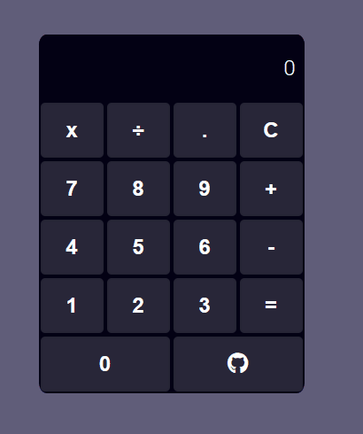

# Calculadora React

Esse é um projeto feito durante os estudos de Front-end com React para a compreensão dos conceitos iniciais da biblioteca. O projeto foi desenvolvido usando como base o um projeto na formação React na [DIO](https://dio.me/sign-up?ref=9RS1X8XBOV).

Caso deseje você pode testar esse projeto em produção [clicando aqui](https://calculadora-react-martvie.vercel.app/).

## Imagens do projeto

<p align="center">

</p>


## Funcionalidades

- Funções de calculo
- Responsividade


## Como rodar o projeto

Como já mencionado você pode testar o projeto em produção online clicando no [link](https://calculadora-react-martvie.vercel.app/) disponibilizado, mas caso queira testar em sua própria máquina acessando o código basta seguir o passo a passo.
Primeiro clone ou baixe o repositório, para isso você pode usar os comandos:


```bash
git clone https://github.com/Martvie/calculadora-react.git
cd calculadora-react/

```

Se usa o VsCode e ele não está aberto você pode iniciar a ferramenta direto na pasta raiz usando:
```bash
code .
```
Depois disso para instalar as dependências do projeto use o comando `npm`:
```bash
npm install
```
E quando instaladas use:
```bash
npm start
```
Quando quiser encerrar o processo é só usar as teclas **ctrl + c** no terminal.


    
## Aprendizados

Esse foi um projeto bem divertido de construir ainda com pouco contato com a biblioteca React, em seu desenvolvimento tive meus primeiros contatos com os Hooks e com a biblioteca Styled-Components, até então eu não havia feito nenhum projeto de React na prática e foi interessante ver como um projeto simples como esse já demonstra dos potenciais dos componentes principalmente no auxilio a um código mais prático e poderoso!


## Autor

- [@Martvie](https://github.com/Martvie)
